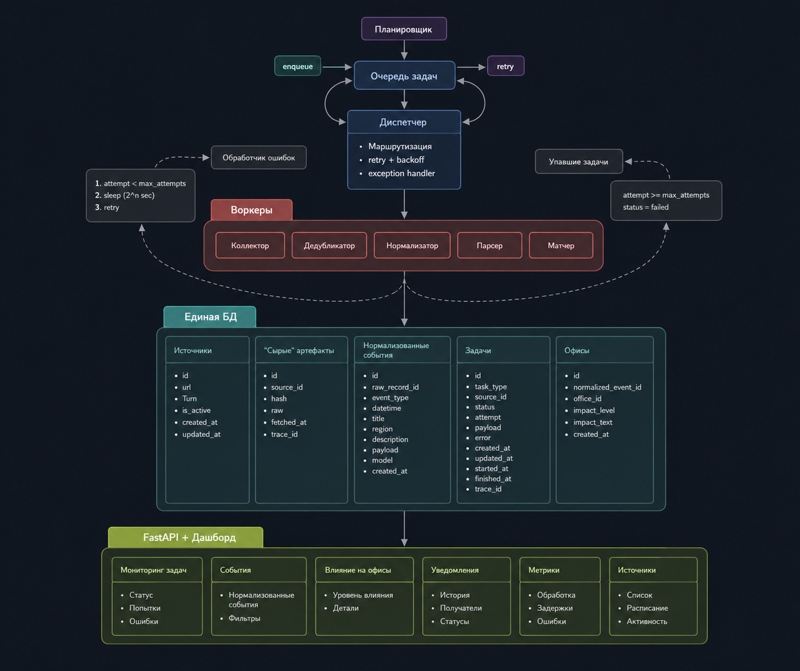

# Power Outage Agent

Прототип агента, который раз в N часов парсит сайты энергокомпаний, узнаёт о плановых отключениях, сопоставляет с адресами офисов и шлёт уведомление в корпоративные каналы.

## План на 4 недели

### Неделя 1 - скелет

- [x] Репозиторий, архитектура v0, стэк
- [x] Базовая структура (директории, модули)
- [x] Первичная инфраструктура: планировщик, очередь, воркеры (коллектор и парсер)
- [x] Архитектура адаптивного парсера
- [x] Простой нормализатор (затычка)
- [ ] Запись в БД, схемы, базовый dedup

### Неделя 2 - реальный парсинг + LLM

- [ ] Расширение парсера до 2-3 источников (соцсети, сайты энергокомпаний, администраций)
- [ ] Унификация формата RAW-данных 
- [ ] Подготовка промптов
- [ ] Подключение LLM для нормализации
- [ ] Улучшенный dedup (время + адрес + источники)
- [ ] Обработка краевых случаев (пустые поля, битые данные)

### Неделя 3 - матчинг 

- [ ] Модель офисов (адреса, регионы, базовая нормализация), офисы в закрытом контуре - придумать как туда ходить
- [ ] Приведение адресов к единому формату 
- [ ] Базовый матчинг: точное совпадение
- [ ] Генерация событий о затронутых офисахлм

### Неделя 4 - расписание и причёсывание

- [ ] Реализация алертов (дашборд, логи, уведомления в тг, шина событий)
- [ ] Настройка триггеров (когда и при каких условиях отправлять уведомления)
- [ ] Retry и обработка ошибок 
- [ ] Базовая идемпотентность
- [ ] Подготовка демо-сценария

## Текущий статус

**08.05.2026 — конец недели 1**

Скелет системы готов и локально запущен. Pipeline поднимается, БД инициализируется, scheduler ставит задачи в очередь, воркер забирает их и делает HTTP-запросы с exponential backoff retry . Все core-модули написаны: Pydantic-схемы по spec, async SQLAlchemy модели (Source / RawRecord / TaskRecord), конфиг через .env.

Остаток недели 1: дописать сохранение raw-контента в БД и загрузку источников из таблицы sources вместо хардкода.

На следующей неделе: подключение реальных источников (сайты энергокомпаний), LLM-нормализация, улучшенный dedup.