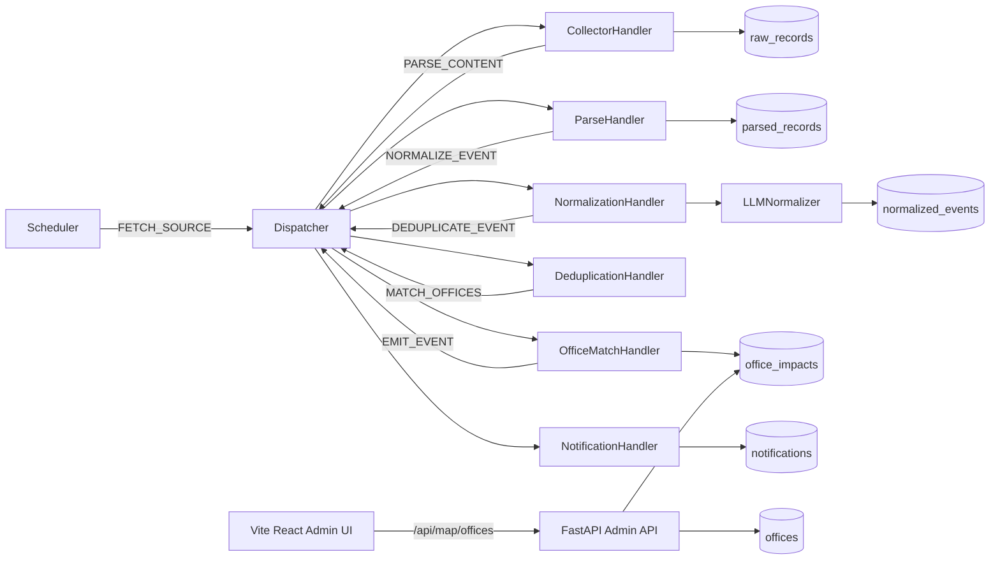

# Architecture Notes

Этот файл фиксирует текущие архитектурные решения проекта. Подробная документация по коду лежит в `docs/doc.md`, продуктовая спецификация — в `docs/spec.md`.

## Текущий контур

Power Outage Agent — минимальный event-driven pipeline без внешнего брокера. Все задачи проходят через in-memory `TaskQueue`, а состояние задач пишется в PostgreSQL (`tasks`).

## Основные решения

### 1. Источники управляются через БД

Источники лежат в таблице `sources`. При пустой таблице `SourceStore.seed_if_empty` создаёт дефолтные записи.

Добавление источника должно требовать минимум изменений:

- новая запись в `sources`;
- новый parser class, если формат ещё не поддержан;
- регистрация parser-а в `_PARSER_REGISTRY`.

### 2. `parser_profile` — точка расширения источника

`parser_profile` хранит source-specific поведение:

- `parser`;
- `date_filter_days`;
- `verify_ssl`;
- `paginate`;
- `date_params`;
- `normalize_enabled`;
- `normalize_limit`.

Так pipeline не знает про особенности Bitrix-пагинации, SSL на российских root CA или размер конкретного API.

### 3. Raw хранится отдельно от parsed

`raw_records` — audit log того, что реально пришло от источника. Dedup raw делается по `content_hash`.

`parsed_records` — детерминированная структурированная проекция raw. Её можно пересоздать при изменении parser-логики.

### 4. LLM-нормализация отделена от парсинга

Парсеры отвечают за дешёвую структурную экстракцию. `LLMNormalizer` отвечает за:

- нормализацию адреса;
- классификацию типа события;
- confidence;
- приведение ответа к `NormalizedEventSchema`.

**Текущий провайдер — Sber GigaChat** (модель `GigaChat-2`). Реализация — в `app/normalization/llm.py` (бизнес-логика, промпт) поверх `app/normalization/gigachat_client.py` (транспорт: OAuth, chat completion, кеш токена). У GigaChat нестандартный OAuth (Basic auth → `/oauth` → access_token), поэтому он не помещается в OpenAI SDK — клиент реализован напрямую на `httpx`.

Поля `LLM_BASE_URL`/`LLM_API_KEY`/`LLM_MODEL` в конфиге зарезервированы под DeepSeek/OpenAI-compatible baseline для будущего переключения — на данный момент `LLMNormalizer` хардкодит GigaChat. Когда понадобится мульти-провайдер, понадобится фабрика по `provider` ключу в settings.

### 5. LLM-вызовы ограничиваются на уровне источника

Крупные источники могут давать тысячи записей за один poll. Чтобы не сжечь квоту и не создать огромную очередь:

- Россети Сибирь: `normalize_enabled=false`;
- eseti.ru: `normalize_enabled=false`;
- Россети Томск: `normalize_limit=3`.

Это smoke-safe дефолт. Для полноценной нормализации нужны батчи, rate limits и дедуп до LLM там, где это возможно.

### 6. Ошибки провайдера делятся на retryable и permanent

Transport-уровень (HTTP 5xx, network, OAuth failure) — бросается из `LLMNormalizer` наружу, Dispatcher делает экспоненциальный retry (max 5 попыток) и в DLQ.

LLM-уровень — невалидный JSON, нарушение схемы, отсутствующий `start_time` — `LLMNormalizer` возвращает `None`. `NormalizationHandler` пропускает запись без записи в `normalized_events`. Не ретраим — модель в следующей попытке скорее всего отдаст тот же мусор.

### 7. Офисы имеют ручные координаты

`Office` хранит `latitude` / `longitude` как nullable поля. Координаты задаются
вручную в seed/БД; автоматический геокодинг намеренно не используется, чтобы не
тащить API-ключи, лимиты и платные карты в MVP.

Офис без координат остаётся валидной записью:

- matcher и уведомления продолжают работать по адресу;
- `GET /api/map/offices` возвращает такой офис;
- frontend не рисует маркер и показывает офис в списке `Missing coordinates`.

### 8. Карта — UI-проекция, а не гео-платформа

Карта офисов реализована как отдельная страница `/map` в существующем Vite/React
admin UI. Используется Leaflet напрямую, без нового frontend-фреймворка и без
Google/Yandex Maps API. Leaflet загружается lazy только для route `/map`, чтобы
не утяжелять стартовый dashboard.

Endpoint `GET /api/map/offices` отдаёт готовую UI-проекцию:

- офис;
- координаты;
- текущий статус `ok | risk | critical`;
- список активных impacts.

Фильтрация остаётся локальной на фронтенде: данных мало, backend query language
для карты не нужен.

### 9. Статус карты считается от активных impacts

Активный impact:

- `impact_start <= now`;
- `impact_end IS NULL OR impact_end >= now`.

Статусы:

- `ok` — активных impacts нет;
- `risk` — есть low/medium/unknown active impact;
- `critical` — есть high/critical active impact или нормализованное событие явно
  похоже на outage/closure.

## Следующие архитектурные шаги

1. Калибровать dedup нормализованных событий на реальных дублях.
2. Расширить Office Matcher за пределы MVP-эвристик.
3. Batch/rate-limit слой для LLM.
4. Alembic-миграции вместо `Base.metadata.create_all`.
5. Re-enqueue pending/running задач после перезапуска.
6. Persistent queue-depth time series для dashboard.
